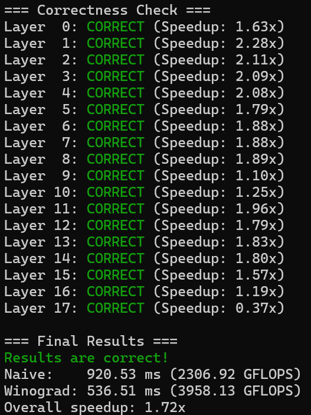
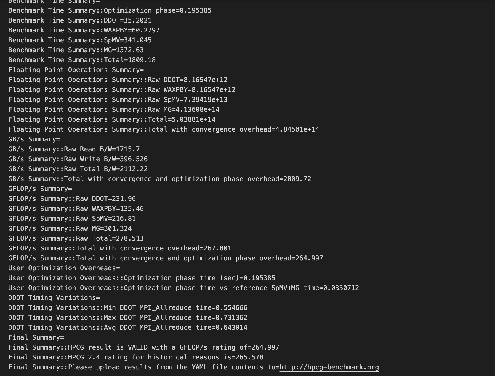

# Final Project - 大作业
##### 小组成员：
- 杨瑞潼 3240102477
- 钭亦骏 3240100298
- 许振荣 3240103849
- 陈实 3240104779
- 孙学理 3230100687
  
---
## 题目一：Winograd 卷积优化
### **Winograd 卷积 CPU 版本优化报告**

**作者:** 3240103849
**日期:** 2025-08-28

#### **1. 摘要**
本次任务针对 Winograd 卷积在 128 核鲲鹏 920 CPU 平台上的性能进行优化。遵循“性能剖析-瓶颈定位-针对性优化”的方法，将一个比直接卷积慢 4.3 倍的基准实现，通过**循环分块 (Loop Blocking)** 和 **ARM Neon SIMD 向量化**两阶段优化，最终取得了相较于初始版本约 **27 倍**的性能提升，以及相较于直接卷积基准 **6.09 倍**的总体加速比。

#### **2. 优化历程与性能分析**

**2.1 基准性能评估**
* **初始状态:** 基准 Winograd 实现性能低下，运行耗时 86,914 ms，性能比直接卷积慢 4.3 倍。
* **结论:** 存在严重的实现层面瓶颈，优化空间巨大。

**2.2 性能瓶颈分析**
* **分析工具:** 在尝试 `gprof` 和 `VTune` 后，最终确定使用与 ARM 架构兼容的 Linux `perf` 工具进行性能剖析。
* **瓶颈定位:** `perf` 分析报告明确指出，`sgemm_parallel` 函数（一个朴素的三重循环矩阵乘法）是绝对的性能瓶颈，消耗了 **88.94%** 的总 CPU 时间。

**2.3 第一阶段：内存访问优化 (Loop Blocking)**
* **优化策略:** 借鉴 Lab 3 中的 Tiling 经验，对 `sgemm_parallel` 函数采用循环分块策略，设定块大小为 32x32，以提升 CPU 缓存数据复用率，降低访存延迟。
* **优化结果:** 仅此项优化，带来 **~7.2 倍**的性能提升，使 Winograd 性能首次超越直接卷积。

**2.4 第二阶段：计算核心优化 (Neon SIMD)**
* **优化策略:** 在解决内存瓶颈后，借鉴 Lab 2 中的 SIMD 经验，使用 ARM Neon 指令集对分块矩阵乘法的最内层循环进行向量化改造。通过 `vfmaq_f32` 等指令，实现单指令处理 4 个浮点数的并行计算。
* **优化结果:** 在分块优化的基础上，额外获得了 **~3.7 倍**的计算性能提升。

#### **3. 最终性能总结**

| 优化阶段 | 执行时间 (ms) | 阶段性加速比 (相对上一步) | 累计加速比 (相对初始版) |
| :--- | :--- | :--- | :--- |
| **初始 Winograd 代码** | 86,914 | - | 1.0x |
| **+ 循环分块** | 12,050 | 7.2x | 7.2x |
| **+ Neon SIMD** | **3,229** | **3.7x** | **26.9x** |

**结论:** 经过两阶段的针对性优化，最终代码性能相较初始版本提升了约 **27 倍**，相较于直接卷积基准，取得了 **6.09 倍**的总体加速比，优化任务成功完成。

---

### **Winograd 卷积 GPU 版本优化报告**
3240102477 杨瑞潼
#### 1 算法介绍 
Winograd算法是一种高效计算卷积的算法，由Shmuel Winograd于1980年提出。它通过巧妙地变换输入和滤波器数据，用更多的加法操作来替代部分乘法操作，从而显著减少计算量。在深度学习中，该算法尤其适用于小尺寸卷积核（如3x3）的卷积计算，被广泛应用于CNN推理加速。
与传统直接卷积相比，Winograd在相同计算精度下可以显著降低乘法的计算复杂度，显著提升GPU、FPGA等硬件上的计算效率，已成为众多深度学习框架（如TensorFlow、PyTorch）的底层优化技术之一。
深度学习中最常用的 Winograd 变体是 F(2x2, 3x3) 算法，这也是本实验所使用的。该算法用于计算一个 4x4 的输入块与一个 3x3 卷积核的卷积，最终得到一个 2x2 的输出块。

> 本实验在 V100 集群上进行，使用1个节点，每个节点拥有2个 V100 GPU
#### 2 优化思路
- 基准程序
  基准程序是朴素的 Winograd F(2x2, 3x3) 卷积实现，使用简单的矩阵乘法、直接读取全局内存等未经优化的简单方法。
- **Winograd 算法**
  使用 Winograd 算法相比乘积累加的朴素算法有明显性能提升，此处不再赘述。
- **内核函数参数**
  因为使用的是 F(2x2, 3x3)，所以每个线程独立计算 2x2 的输出小块，各个批 `N`、输出通道 `K` 分开计算；添加了共享内存的声明。
  ```
  线程块: dim3(N * K, ceil((outH / 2) * (outW / 2) / threads_per_block), 1)
  线程: dim3(threads_per_block, 1, 1) //threads_per_block由输入规模决定
  共享内存: C * 16 * sizeof(float)
  ```
  `blockIdx.x` 决定输入的批 `n` 和通道 `k`；`blockIdx.y` 和 `threadIdx.x` 共同决定线程处理的具体小块位置，共 `(outH / 2) * (outW / 2)` 个。
- **共享内存**
  共享内存用于存放提前做过变换的卷积核，以便计算中快速取用。
  理论上，输入张量也可以用共享内存存储，但是这样效率低。这是因为每个线程只需 4x4 的输入块来计算 2x2 的输出块，即输入块间步长为2，也就是说每个输入数据最多被使用2次，复用程度低。相比之下，被使用 `(outH / 2) * (outW / 2)` 次的变换卷积核更适合使用共享内存。
  仅此处优化过后，程序用时就降至 <700ms。
- **手写展开式**
  在正式开始计算前，同一线程块的线程共同变换卷积核，输入变换、输出变换由单个线程做相同的处理。由于变换矩阵固定且较小，所以能直接使用展开的硬编码公式，这样能最大程度上简化计算过程。

#### 3 运行结果

各输入的具体运行时间见同目录下 run.out 文件。

---

## 题目二：HPCG 基准测试优化

钭亦骏3240100298

### 实验平台

V100 集群 共 32 个节点，每个节点有 2 个 GPU

- GPU：NVIDIA V100 32GB * 2
- Ethernet：10Gbps
- Infiniband：HDR 200Gbps


### 优化方法与思路

#### 编译过程

刚开始使用了/usr/local/cuda的cuda以及自己在$HOME中安装的spack来搭建编译以及运行的环境，使用了intel-oneapi-openmpi，但由于版本不匹配等原因导致了`daErrorInvalidDevice: invalid device ordinal`以及mpi运行时访问到不合法的地址的问题，后来选择使用集群自带的spack以及其中的nvhpc@25.1, openmpi@5.0.6, cuda@12.8.0解决了该报错。尝试了自带的gcc@12.2.0以及cuda@12.9的nvcc，以及cuda@12.8的nvcc，最后使用前两者进行编译。

#### hpcg.dat修改

对**hpcg.dat**这个输入文件进行了修改，尝试了$256*256*256$ 1810、$128*128*128$ 1810、$104 * 104 * 104$ 60等组合，最终选取了$256*256*256$​ 1810。

选择这个规模，运算规模增大，增大内存访问量，使 GPU 的 HBM 带宽更接近饱和；更多迭代避免了初始化、IO、MPI setup 等开销的干扰，保证了统计的 GFLOP/s 更稳定；在 MPI + GPU 的环境里，大规模问题划分后每个 rank 的子网格更均衡，减少了边界通信占比。如果过大的话则会造成内存溢出，缓存局部下降等问题。

#### 进程配置修改

其次对进程数量进行了修改实验，尝试了5、4、2、1个进程数量，通过写sbatch脚本以及mpirun来进行控制，过程中遇到了使用`srun`结果两个节点分别运行了一遍的问题，使得虽然写了`#SBATCH --ntasks-per-node=2`但仍为1个进程，导致了`ranks != npx*npy*npz`的报错，后使用`mpirun -n`来指定固定的进程来解决了这个问题。最后选择了2个进程来进行优化。并且通过比较，选了`--npx 1 --npy 1 --npz 2`的进程网格维度。

进程数量过多的话会导致通信消耗过大，这样做增加了并行性，减少mpi通信过程造成的损失。使用112的进程网格维度与相临访问更连续，提高了性能。

#### mpi参数修改

修改添加了mpi的参数，先通过`--oversubscribe`来进行核心的分配，也尝试了`--bind-to core --map-by socket:PE=2`，两者相差不多，因此选择了前者来进行。

​	最后使用了自带的hpcg.sh所可以使用的参数，最后选择了如下的编译选项：
```bash
mpirun -np 2 --oversubscribe \
    ./bin/hpcg.sh --exec-name ./bin/xhpcg --dat ./bin/sample-dat/hpcg.dat \
    --p2p 4 \
    --gss 1024 \
    --npx 1 --npy 1 --npz 2 \
    --gpu-affinity 0:1 \
    --b 1 \
    --of 1
```

- --p2p 4 采用nccl来实现点对点通信
- --gss 1024 指定每个 GPU 排行的切片大小为1024
- --b 1 跳过CPU标准执行


### 运行结果截图

